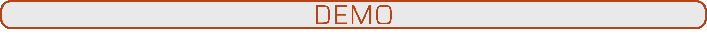
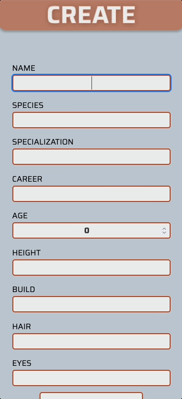
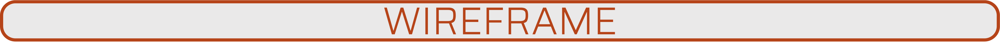
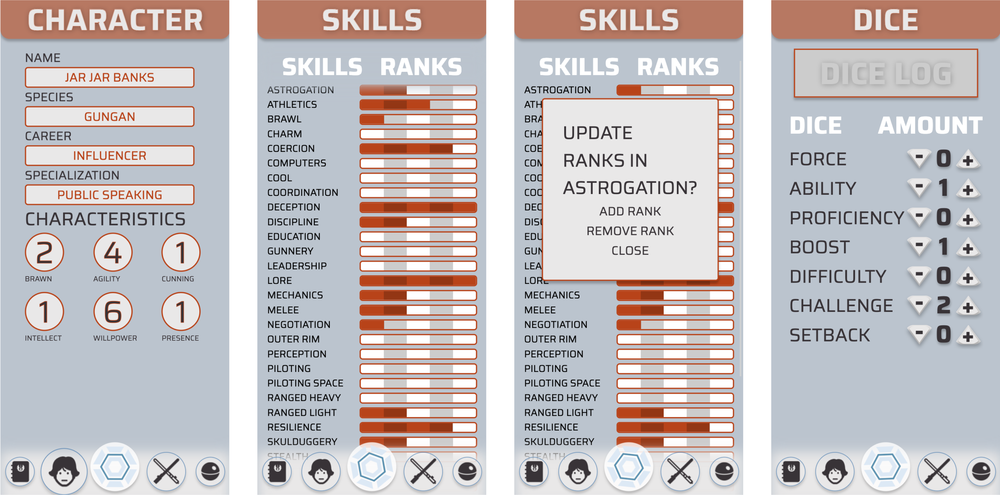
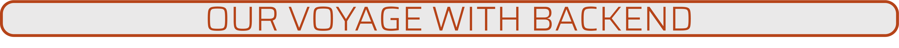

This application acts as a companion to the tabletop RPG **Star Wars: Edge of the Empire**. This companion app allows you to store your in-game characters, including details, stats, and skill ranks. A dice roller is also included so that your adventure may unfold into the legendary campaign it was always meant to be. 

<div align='center'>

 Check out the [deployed app](https://swrpg-companion.herokuapp.com/home) on your mobile device and start your campaign today! 
 
 </div>


 - User may create a new character that contains their information, characteristics, and skills.
 - Dice rolls can be be configured to any desired combination.
 - All of your characters can be seen in one place.
 - Skill ranks may be edited whenever you want.
 - Optimized for mobile devices for convenience during gameplay.
 



  
 
  

To run locally, clone the project and install dependencies

```szh 
git clone git@github.com:SWRPG-Capstone/swrpg-fe.git
cd swrpg-fe
yarn
yarn start
```







- Account Authorization.
- Visual Dice Rolls.
- Permanent roll history.
- Friends list with social features. 
- More character editing abilities.
- Calibrate media queries for desktop view.

<br>



This project was our capstone project for our final module at the Turing School of Software and Design. It was our first chance to work on a full-stack team as we were now paired with students from the backend program at Turing. Our special-feature, exclusive behind-the-scenes database may be seen [here](https://github.com/SWRPG-Capstone/swrpg-be). Extra content includes the queries we used to make the magic happen!


<div align="center">  


 

 
 
 
<a href="https://circleci.com/gh/SWRPG-Capstone/swrpg-fe/tree/main"></a>
</div> 

---


### <div align=center> **Lauren Kessell** </div>

---

[Github](https://www.github.com/LKessell)
&
[Linkedin](https://www.linkedin.com/in/lauren-kessell/)


**Learning goals:**
- Gain experience working with a back-end team
- Implement a git rebase workflow
- Learn about GraphQL using the Apollo Client

**Challenges:**
- Capturing the character ID created after the first page of the form is submitted, then passing that value to the final pages of the form
- Intercepting/Stubbing GraphQL responses in the Cypress testing
- Implementing GraphQL mutations

**Reflections:**  
I learned SO MUCH from this project! There were a lot of new experiences happening all at once, but I did my best to keep tackling tasks one at a time without getting overwhelmed. I think the front end could have really benefitted from making the connection to the back end sooner, or setting a firm JSON contract early. I also struggled with spending a little too much time researching GraphQL up front, which didn't leave enough time to fully complete our implementation and testing. I think our team did a great job of communicating despite our scattered schedules, and I'm really proud of what we accomplished! There's a ton of room for continued growth on this project, and I'd like to continue making improvements/ (I really want to set up some user authentication!)


 

### <div align=center> **Andrew Vallejo** </div>

---

[Github](https://www.github.com/andrewvallejo)
&
[Linkedin](https://www.linkedin.com/in/andrewvallejo/)

**Learning goals:** Our stretch technology chosen for this project was Apollo & GraphQL. I have never used anything outside of RESTful APIs and found this project as an opportunity to expand my knowledge in the area. I also wanted to know what it was like to work amongst an actual backend team for this project.

**Challenges:** Exploring the unknown is always a challenge, especially when involving technlogies that span between both developer stacks. It was fortunate that communication was prominent in our team and we were able to bridge a connection between Apollo and GraphQL. It was challenging that we didn't try to establish this connection more early on. Also, the logic for the dice seemed decievingly easy when establishing the features we needed. Since all of the dice have custom values, we had create a dice mechanic which required a lot of logic for it to be able to operate the way it woud in real life. 


---

 <div align='center'><sub>May the force be with you</div></div>

